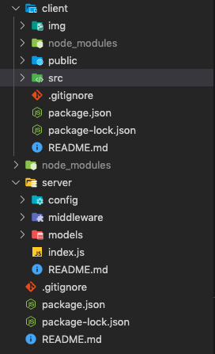
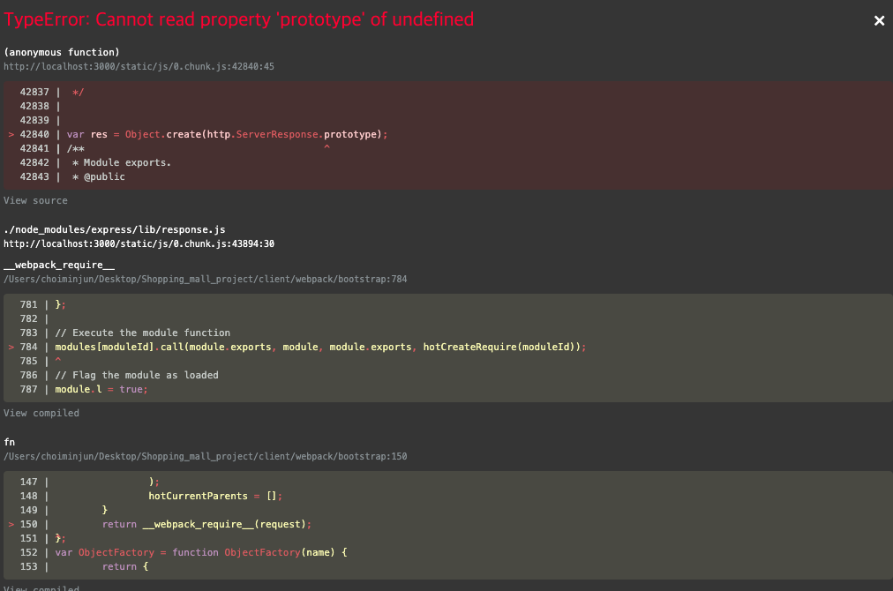
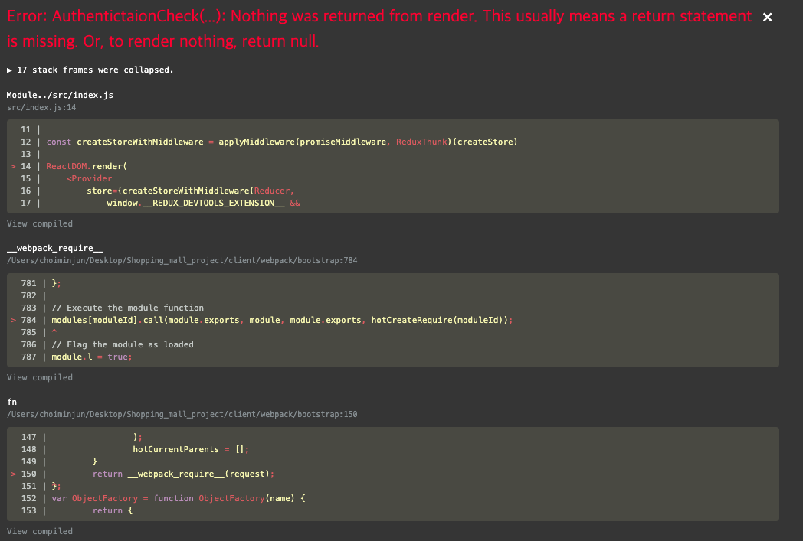
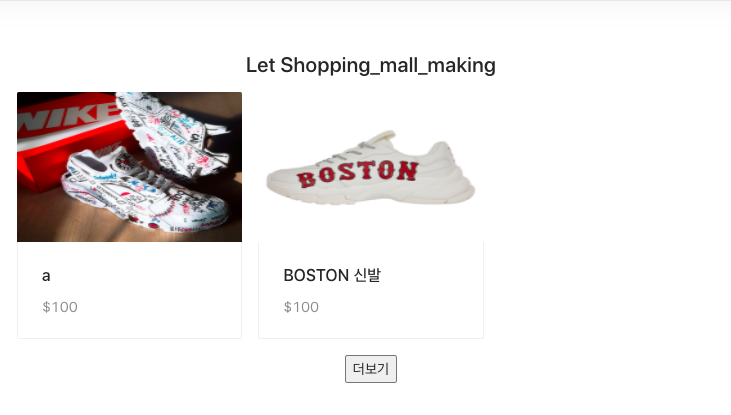

# 0922
# FrontEnd Part
---------------
# 회원 정보 관련 
---------------
## 1. server와 client 분할 및 각종 폴더 생성


---------------
## 2. React-router-dom 설치
    npm install react-router-dom 및 Vscode에서 ES7/React/Redux/React-Native/Js snippets 설치
---------------
## 3. axios 및 proxy install

    proxy 사용이유
    컴퓨터 네트워크에서 다른 서버 상의 자원을 찾는 클라이언트로부터 요청을 받아 중계하는 서버를 말합니다. 간단히 말해서 중계해주는 서버라고 생각하면 됩니다.
    즉 server의 포트와 client의 포트를 연결해주는 역할 
------------------
## 4. concurrently 설치 
    npm install concurrently --save 
    Root 폴더에 설치 할것

    package.json 수정
      "scripts": {
         "start": "node index.js",
        ** "nodemon": "nodemon server/index.js", **
         "test": "echo \"Error: no test specified\" && exit 1",
        ** "dev": "concurrently \"npm run nodemon\" \"npm run start --prefix client\"" **
  },
  --------------------
  ## 5. npm install redux react-redux redux-promise redux-thunk --save
    역할

    thunk는 dispatch에게 function을 받는 방법을 알려줌
    promise는 dispatch에게 promise를 받는 방법을 알려줌

    redux store 안에서 모든 state를 관리  state를 변경 할려면 dispatch를 이용해 action으로 변경

    import React from 'react';

------------------------
## 5-1 App.js에 redux 추가 

```javascript    
    import {Provider} from 'react-redux' 
    import ReactDOM from 'react-dom';
    import './index.css';
    import App from './App';
    import * as serviceWorker from './serviceWorker';

    ReactDOM.render(
    <Provider>
        <App />
    </Provider>,
    document.getElementById('root')
);
serviceWorker.unregister(); 
```
---------------------------
## 6. dispatch란 
     디스패치는, 액션을 발생 시키는 것 이라고 이해하시면 됩니다. dispatch 라는 함수에는 액션을 파라미터로 전달합니다
-----------------------------
## Error 
## TypeError: Cannot read property 'prototype' of undefined

    코딩을 하다보면 위와 같은 에러가 가끔식 나타난다. 이 오류를 찾기 위해 1시간 정도 소비 되었는데 결과는 간단 했다. 
 ```javascript   
        import { response } from "express";
 ```
 ### 해결방법
    이것 때문에 response를 입력하다면 자동적으로 생성 되는데 브라우저에서는 Node.js 기반의 익스프레스를 인식 하지 못한다.
    해결법은 그냥 저것만 삭제하면 된다.

-----------------------------
## Auth - 인증 관련
    // null - 아무나 출입이 가능한 페이지
    // true - 로그인한 유저만 출입이 가능한 페이지
    // false - 로그인하 유저는 출입이 불가능한 페이지
-------------------------------
## Error
## AuthenticationCheck(...)


### 해결방법

Auth.js
 ```javascript 
    return(
        <SpecificComponent/>
    )
```
를 적용
--------------------------------
# 0925
--------------------------------
## 업로드 페이지 만들기
## 업로드 onChange Event 
## 업로드 Select option 
## 업로드 Drop-zone (client)
     npm install react-dropzone --save

     한페이지에 모든것을 코딩하면 코드가 너무 길기 때문에 FileUpload 페이지 따로 만들기
--------------------------------
## multer 설치(server)
    npm install multer --save
--------------------------------
## FileUpload.js
### splice 이란
```javascript 
  const deleteHandler = (image)=>{
   ...
    let newImages=[...Images]
    newImages.splice(currentIndex, 1)
    //splice() 메서드는 배열의 기존 요소를 삭제 또는 교체하거나 새 요소를 추가하여 배열의 내용을 변경합니다.
    //선택한 이미지에서 부터 1개를 지우겠다.
    setImages(newImages)
    ...
  }
```
    이부분에서 사용한 splice() 메서드는 배열의 기존 요소를 삭제 또는 교체하거나 새 요소를 추가하여 배열의 내용을 변경 할때 사용한다.
-------------------------------
 ## 이미지 state을 부모 컴포넌트로 업데이트
    이미지 정보가 FileUpload에 있고 UploadProduct에 없기에 이를 
    부모 컴포넌트로 보내야 확인을 누를때 파일 정보가 서버로 올라간다.
---------------------------------
# 렌딩페이지 만들기
---------------
## 데이터 베이스에 들어 있는 모든 상품 정보 확인(개발자 도구)
---------------
## DB에 모든 데이터 불러와서 화면에 뿌려주기


    화면에 따른 디자인을 할 떄 화면 분할은 최대 24로 하는것이 계산하기 쉬워진다. 
    최대 즉 xs=24, md=8, lg=6으로 하는것이 편하다.
-------------
## 렌딩 페이지에 사진 갯수 제한 
```javascript 
  const [Skip, setSkip] = useState(0)
  //0번째 사진 부터 출력 
  const [Limit, setLimit] = useState(8)
  //8개만 출력 해라

  // 등록 상품 가져오기
  useEffect(() => {
    //body
    let body = {
      skip : Skip,
      limit : Limit
    }
    axios.post("/api/product/products", body).then((response) => {
      if (response.data.success) {
        console.log(response.data);
        setProducts(response.data.productInfo);
      } else {
        alert("상품 가져오기 실패");
      }
    });
  }, []);
```
-------------------
## 자료가 더 없으면 더보기 버튼 사라지기
--------------------


